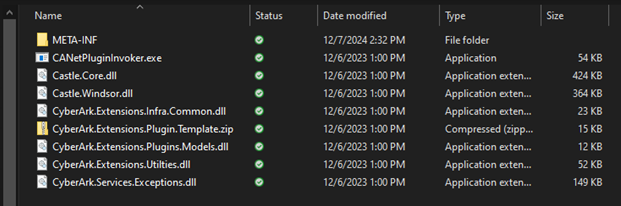
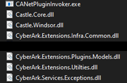
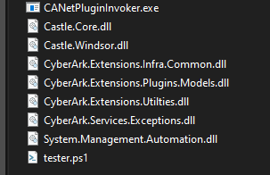
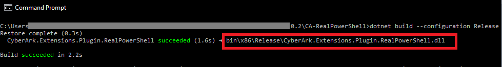
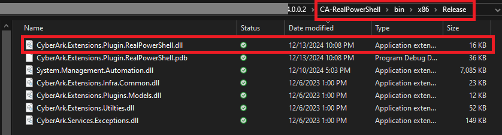
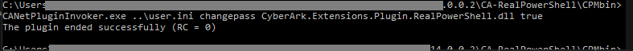

# CyberArk-UniversalPowerShellPlugin
## <i>A plugin to make creating plugins just a little easier</i>

**CyberArk-UniversalPowerShellPlugin** is a prepopulated template of the   [CyberArk .NET SDK](https://docs.cyberark.com/pam-self-hosted/latest/en/content/pasimp/plug-in-netinvoker.htm?tocpath=Developer%7CCreate%20extensions%7CCreate%20CPM%20plugins%7CCredentials%20Management%20.NET%20SDK%7C_____0) that abstracts complicated code like C# and [Prompts/Process Files](https://docs.cyberark.com/pam-self-hosted/latest/en/content/pasimp/plug-in-terminal-plugin-controller.htm) down to simple PowerShell code! In other words, **you can write 99% (or more) of your code in PowerShell <u>without</u> ever needing to touch or know those other complicated languages.** Many CyberArk folk don't have the time to learn other languages and often PowerShell is already utilized (BIG shout out to [psPAS](https://github.com/pspete/psPAS)). Here are the highlighted features of this plugin:

- Intelligently decides the context the plugin itself is being used in (eg [Target](https://docs.cyberark.com/pam-self-hosted/latest/en/content/landing%20pages/lpbuiltinplugins.htm) vs. [Usage "Service"](https://docs.cyberark.com/pam-self-hosted/latest/en/content/landing%20pages/lpserviceplugins.htm)). This means you don't have to decide what kind of plugin you need, you can use the **same** plugin on both! (If you know anything about plugin development which I assume you do being here then you know the value of this)
- Nearly no C# coding needed (unless you have advanced needs to expand on this code). Unless you know C# well, most people just pay a vendor to write this level of code for them when in reality, a rich and full PowerShell script would do just fine. The problem is there is no "direct" way CyberArk gives to run simple PowerShell scripts directly out of CPM.
- Sample PowerShell script provided to show just how easy it is to use this plugin for nearly all your needs
- The best part - **no** Prompts/Process ini files to deal with (sorry if you love those but I find them painful to explain and edit)
- ✨Magic ✨(there may be others who fork or claim credit for this concept but to my knowledge I was first to claim this abstraction which I'm shocked hasn't existed before)

## Disclaimers (who doesn't like a list of those)

These days you can't be too careful so "for the record" note the following:

- My code has <u>**not**</u> been endorsed, supported, reviewed, or encouraged by CyberArk or their affiliates
- **All plugins that YOU make are in a 100% NON-supported state from CyberArk** (and rightfully so). **In other words, "you code it you own it" so don't expect CyberArk to troubleshoot it** (This is a major Pro for paying CyberArk or other vendors to write plugins if cost is no concern)
- While I have tested this code myself, YOU are solely responsible for it being used for your purposes. I take zero responsibility for any and all issues caused by its consumption.
- I cannot and will not provide "official support" for this plugin. Anyone in the CyberArk business knows that CyberArk consultants at minimum make ~$250+ per hour so as much as I'd love to support it, it's unrealistic for me to do so
- I built this code during my own personal time (not work hours), using my own personal PC (not work), my own personal paid Visual Studio Pro license from my own bank account, and my own collected thoughts (intelletual property) 
- Regarding the code itself:
  - My code does not follow some best practices to which I admit directly and openly. My objective was not to win first prize on "C# Best Practices 101".
  - My primary object was to make code that "works" and is "easier to understand" rather than "efficiency" or "minimal resources". (eg there is plenty of redundancy and room for fancy things like abstract classes, sharing methods, etc. but I chose not to use those to try and keep the code linear and easier to understand for the masses)
  - If you don't like it, think it's trash, hate it, or etc. by all means I encourage YOU to change it on your end. I can't and never will think of everything under the sun
  - If you submit a GitHub issue/pull/etc., I might look at it, but depending what it is but may elect to take no action. This is no reflection on your or the efficacy of your suggestion
  but rather a refletion the level of time/effort on my part I may not want to take

## How do I install/use it?
Download the plugin zip file from this GitHub Release page similar to how you would from the CyberArk Marketplace and
[follow the latest instructions from CyberArk on importing plugins](https://docs.cyberark.com/pam-self-hosted/latest/en/content/platforms/platform-packages-import-introduction.htm?Highlight=import%20plugin#Importaplatformpackage).

## Support
I can't "build you a plugin" and I'm not "in a chat room" somewhere to offer help and I can't "troubleshoot" everything. That said, if this plugin helps you feel free to support me if you wish (no obligation but every bit helps):

[Like what you see? Buy me a coffee as a thank you](buymeacoffee.com/mhdevop)

## FAQ
-**Q: A certain vendor already has a plugin (name removed) that handles using PowerShell through a plugin although you have to ask for it (not in the Marketplace). Why can't we just use that and why would we want your plugin instead?**
- A: This certain vendor is careful to offer several disclaimers before giving that plugin to you but the most important is that the plugin passes the **plaintext** password in the command line. All anyone has to do is review the Event Logs and discover the password. If you have an EDR/SIEM that sends your logs off the server the issue gets worse and even more eyes can see this information. Please don't use that plugin.

-**Q: I tried to compile this code on my own because I don't trust your DLL file and get "XYZ" error.**
- A: See the "support" section above and the "how to compile" section below

-**Q: I still don't get what this plugin does and how it's different than the CyberArk Marketplace?**
- A: Imagine you want a plugin to change a password in a SaaS solution (or anything else really). The remote software package has a REST API to allow that automated password change but there is no existing integration within the CyberArk Marketplace. You have 2 choices: A) pay the vendor of your choosing high dollars to make it for you along with the hassle of back/forth paperwork B) create the plugin yourself. Assuming you go with option B you then have 2 more options: A) use CyberArk [Prompts/Process Files](https://docs.cyberark.com/pam-self-hosted/latest/en/content/pasimp/plug-in-terminal-plugin-controller.htm) method B) use [CyberArk .NET SDK](https://docs.cyberark.com/pam-self-hosted/latest/en/content/pasimp/plug-in-netinvoker.htm?tocpath=Developer%7CCreate%20extensions%7CCreate%20CPM%20plugins%7CCredentials%20Management%20.NET%20SDK%7C_____0). (The WebFramework option does not apply here because it only works for human GUIs and not REST APIs). Option A is insanely difficult to work with REST APIs but I've heard it can be done. Option B is more possible yet C# is a complex language and most people just don't have the background/skillset to do it. My code essentially removes the need to know/use C# code and allows you to simply specify the PowerShell script YOU wrote for all the logic/workflow of your plugin. In other words, write your plugin in PowerShell rather than another more complicated languages!

-**Q: So do I actually change/edit any of this repo's code or customize it?**
- A: Ideally, **no** (emphasis on the term "universal") action/changes are required from you. I built this plugin to be highly versital and read in all the account/platform properties in <i>most</i> cases. There a few advanced cases where you would want to modify this code though I would hope those are rare. Some rare scenerious would include: better "validation" of required vs. optional fields that get populated in PVWA; forcing fields to exist or validate, especially those needing "File Categories" created; and if you for some reason to the "logon" and "preconcile" functions of the plugin to actually do something different than automatic success. **The only change you should make is that once you import the platform you should edit the "PowerShellScriptName" (located in the 'bin' folder of CPM) in the platform to point to the PowerShell script you wrote.**

-**Q: You mentioned that this plugin can be used for both Targets and Usages (Service). So doesn't that mean this one plugin could be used Universally?** 
- A: Yes! That's the idea and why the name of this plugin is Universal. You import the platform and then you add a unique PowerShell script for each type of integration. In other words, the only thing that changes is the script name you populate in the platform (on optionally on the Account itself if you create a File Category for it). The end result is that you'll have <i>many</i> PowerShell scripts for each type of integration yet only this **one** single plugin spanning all of them.

-**Q: I <i>think</i> I get how cool this really is now, so how do I use it?**
- A: You have two options: 
    A) <i>recommended</i> - check out the release section of this GitHub repo and download the ZIP file to import the platform
    B) <i>not recommended unless you really know what you're doing</i> - download just the DLL plugin itself from the release portion, manually copy to your CPM bin folder, and edit existing platforms of yours to point to it. You'll also need to add the missing parameters in to it

-**Q: You want me to just "trust you" in this day and age before I download that DLL from your release page? How about you tell me how to compile the code myself so I can customize it or at least know the code I'm compiling is generating the DLL I want?** 
- A: Can't say I blame you. I also say that, like CyberArk, I put no "questionable code" in my code. There is no "call home" no "metric collection" no "statistic" 
no "Google Analytics" type things in my code. I couldn't tell, even if I wanted, what company was using my plugin and believe me, that's a legal problem I don't want to have.
It's also worth mentioning that I like GitHub and don't want to breach their code of conduct. See the compiling section for info on that, though, I can tell you it's 
obviously way faster to just grab the release and use that.

-**Q: If I want to compile this C# project myself but don't I need [Visual Studio Professional](https://visualstudio.microsoft.com/vs/professional/) which costs tons of money?**
- A: While it's a far better experience to edit code and "see" things from a human perspetive, **no**, it's not "required" to simply compile this code. I spent a LOT of time
researching how to skip needing such an expensive software package. It can be done "free" using a simple command line action - see compiling steps below. 

## How To Build (Compile) this Plugin DLL
<i>Caution: compiling code can be a complicated process. If you go this route, please be prepared to troubleshoot or if you give up, you can always just grab the latest DLL of the release page and skip compiling altogether</i>

These are the steps that I've personally tested and got working though the steps may differ for your environment so you will need to adjust them accordingly. If you happen to have [Visual Studio Professional](https://visualstudio.microsoft.com/vs/professional/) already then you can simply right-click on the "Solution CyberArk.Extensions.Plugin.RealPowerShell" and "Build Solution" for the same results.

1. Download and install the [.NET 4.8 developer pack](https://go.microsoft.com/fwlink/?linkid=2088517) and install it. Reboot!
2. Search and download the "Credentials Management .NET SDK" from the CyberArk Marketplace (don't ask me for it as I'm not sure of the license surrounding the SDK to freely distribute it)
3. Extract the SDK ZIP file and enter the folder to view the structure and make sure it looks very similar to this:

4. Delete the "template" ZIP file as it's not needed (and what my plugin uses)
5. Download my [GitHub Repo](https://github.com/mhdevop/CyberArk-UniversalPowerShellPlugin) to the location of your choosing on your computer
6. From the CyberArk SDK folder you extracted in step #3, COPY all the *.DLL files and *.EXE file:

7. PASTE those CyberArk SDK Files in the folder in this project to the "CPMbin" folder (it already contains a sample PowerShell script)
8. Locate on your machine a Microsoft DLL called "System.Management.Automation.dll" and also copy/paste that in to "CPMbin" folder. (There are many different versions of this file and mine happened to be found at this path within a version subfolder on my PC: **C:\Windows\Microsoft.NET\assembly\GAC_MSIL\System.Management.Automation**). If you get errors during compile about versioning related to this file then you have the wrong version. I'm sorry I can't provide better details but it was a lot of trial and error me to find the version that was compatible with the CyberArk SDK. If you search your computer's entire drive, you could find many different versions of the same file in different paths. You just have to keep trying different ones to get one that works. In my case the winning version was ~7 MB in size). This DLL is the "magic" of this plugin and is what handles most of the PowerShell layer.
9. Double and triple verify that the contents of your "CPMbin" folder have the exact same file names:

10. Now for the moment of truth! In a command prompt window (not PowerShell), enter the commands (subbing the PATH for the exact location you put this GitHub code folder):
`cd /D "C:\THE\FULL\PATH\TO\CA-RealPowerShell"`
then command (assuming you've already installed [.NET 4.8 developer pack](https://go.microsoft.com/fwlink/?linkid=2088517) )
`dotnet build --configuration Release`
11. Assuming your environment is setup correctly, you've followed these steps correctly, and the compiling stars in the sky are aligned you should see success:

12. Navigate within the project folder to see the finished plugin to get "CyberArk.Extensions.Plugin.RealPowerShell.dll"  (......\CA-RealPowerShell\bin\x86\Release):

13. Now that you have the DLL you can replace the existing DLL from the release section of this repo with your own (or copy directly to the CPM if you've already imported it)

## How To Sample or Test this plugin without actually putting it into our environment?
So you have the plugin and want to give it a spin but you don't want it touching your CyberArk Test/Dev environment (you do have one right?). This is good practice and 
here's how you would test it which heavily leverages [CyberArk's Official Documentation on Testing NET plugins](https://docs.cyberark.com/pam-self-hosted/latest/en/content/pasimp/plug-in-netinvoker_test.htm). You can edit the "user.ini" file and the "policy" files to suite your needs or just leave them at default for testing:

1. Complete steps #1 - 9 from the "build" steps in this guide to ensure your "CPMBin" folder has this plugin + **all** the required CyberArk files in it
2. Run the following Command Prompt (not PowerShell) commands (subbing the PATH for the exact location you put this GitHub code folder):
`cd /D "C:\THE\FULL\PATH\TO\CA-RealPowerShell\CPMBin"`
then this command (you can replace "changepass" with the other values the [CyberArk commands documentation](https://docs.cyberark.com/pam-self-hosted/latest/en/content/pasimp/plug-in-netinvoker_test.htm#Runcommand) specifies)
`CANetPluginInvoker.exe ..\user.ini changepass CyberArk.Extensions.Plugin.RealPowerShell.dll true`
3. Assuming you have made no changes to the Project structure or files, you'll see this test output:

4. You can now edit the PowerShell "tester.ps1" script to actually begin replacing it with your own logic. I HIGHLY recommend you familiarize yourself with this sample
PowerShell script <i>first</i> so you can see how the variables are layed out and what's available to you. 