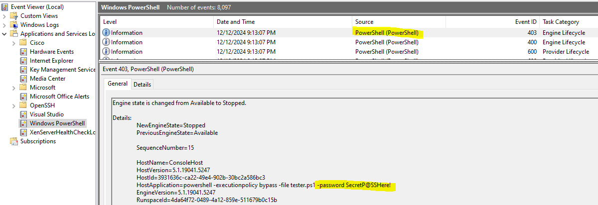

# CyberArk-UniversalPowerShellPlugin
## _A plugin to make creating plugins easier_

**CyberArk-UniversalPowerShellPlugin** is a prepopulated template of the   [CyberArk .NET SDK](https://docs.cyberark.com/pam-self-hosted/latest/en/content/pasimp/plug-in-netinvoker.htm?tocpath=Developer%7CCreate%20extensions%7CCreate%20CPM%20plugins%7CCredentials%20Management%20.NET%20SDK%7C_____0) that abstracts complicated code like C# and [Prompts/Process](https://docs.cyberark.com/pam-self-hosted/latest/en/content/pasimp/plug-in-terminal-plugin-controller.htm) files down to simple PowerShell code! In other words, **you can write 99% (or more) of your code in PowerShell <u>without</u> ever needing to touch or know those other complicated languages.** Many CyberArk folk don't have the time to learn other languages and often PowerShell is already utilized (BIG shout out to [psPAS](https://github.com/pspete/psPAS)). Here are the highlighted features of this plugin:

- Intelligently decides the context the plugin itself is being used in (eg [Target](https://docs.cyberark.com/pam-self-hosted/latest/en/content/landing%20pages/lpbuiltinplugins.htm) vs. [Usage "Service"](https://docs.cyberark.com/pam-self-hosted/latest/en/content/landing%20pages/lpserviceplugins.htm)). This means you don't have to decide what kind of plugin you need, you can use the **same** plugin on both! (If you know anything about plugin development which I assume you do being here then you know the value of this)
- Nearly no C# coding needed (unless you have advanced needs to expand on this code). Unless you know C# well, most people just pay a vendor to write this level of code for them when in reality, a rich and full PowerShell script would do just fine. The problem is there is no "direct" way CyberArk gives to run simple PowerShell scripts directly out of CPM.
- Sample PowerShell script to show just how easy it is to use this plugin for nearly all your needs
- The best part - **no** Prompts/Process ini files to deal with (sorry if you love those but I find them painful to explain and edit)
- ✨Magic ✨(there may be others who fork or claim credit for this concept but to my knowledge I was first to claim this abstraction which I'm shocked isn't more popular)

## Disclaimers (who doesn't like a list of those)

These days you can't be too careful so "for the record" note the following:

- This code has <u>**not**</u> been endorsed, supported, reviewed, or encouraged by CyberArk or their affiliates
- While I have tested this code myself, YOU are solely responsible for it being used for your purposes. I take zero responsibility for any and all issues caused by its consumption.
- I cannot and will not provide "official support" for this plugin. Anyone in the CyberArk business knows that CyberArk consultants at minimum make ~$250+ per hour so as much as I'd love to support it, it's unrealistic for me to do so
- I built this code during my own personal time (not work hours), using my own personal PC (not work), and from my own brain 
- Regarding the code itself:
  - My code does not follow some best practices to which I admit directly and openly. My objective was not to win first prize on "C# Best Practices 101".
  - My primary object was to make code that "works" and is "easier to understand" rather than "efficiency" or "minimal resources". (eg there is plenty of redundancy and room for fancy things like abstract classes, sharing methods, etc. but I chose not to use those to try and keep the code linear and easier to understand for the masses)
  - If you don't like it, think it's trash, hate it, or etc. by all means I encourage YOU to change it on your end. I can't and never will think of everything under the sun

## Support
I can't "build you a plugin" and I'm not "in a chat room" somewhere to offer help and I can't "troubleshoot" everything. That said, if this plugin helps you feel free to support me if you wish (no obligation but every bit helps):

[Like what you see? Buy me a coffee as a thank you](buymeacoffee.com/mhdevop)

## FAQ
-Q: A certain vendor already has a plugin (name removed) that handles using PowerShell through a plugin although you have to ask your account rep for it. Why can't we just use that and why would we want your plugin instead?
- A: This certain vendor is careful to offer several disclaimers before giving that plugin to you but the most important is that the plugin passes the **plaintext** password in the command line. All anyone has to do is review the Event Logs and discover the password. If you have an EDR/SIEM that sends your logs off the server the issue gets worse and even more eyes can see this information. Please don't use that plugin.

-Q: I tried to compile this code on my own because I don't trust your DLL file and get "XYZ" error.
- A: See the "support" section above and the "how to compile" section below

-Q: I still don't get what this plugin does and how it's different than the CyberArk Marketplace?
- A: Imagine you want to build a plugin to change a password in a SaaS solution. It has a REST API to make that password change but there is no existing integration within the CyberArk Marketplace. You have 2 choices: A) pay the vendor of your choosing high dollars to make it for you along with the hassle of back/forth B) create the plugin yourself. Assuming you go with option B you then have 2 more options: A) use CyberArk Prompt/Process files method B) use .NET SDK. (The WebFramework option does not apply here because it only works for human GUIs and not REST APIs). Option A is insanely difficult to work with REST APIs but I've heard it can be done. Option B is more possible yet C# is a complex language and most people just don't have the background/skillset to do it. This code essentially removes the need to know/use C# code and allows you to simply specify the PowerShell script YOU wrote and use that script instead for all the logic/workflow of your plugin. In other words, write your plugin in PowerShell rather than another more complicated language.

-Q: You mentioned that this plugin can be used for both Targets and Usages (Service). So doesn't that mean this one plugin could be used Universally? 
- A: Yes! That's the idea. You import the platform and then you add a unique script for each type of integration. In other words, the only thing that changes is the script name you populate in the platform. The end result is that you'll have many PowerShell scripts for each type of integration yet only this one single plugin spanning all of them.

-Q: Ok ok ok, I think I get how cool this really is so how do I use it? 
- A: You have two options: 
    A) <i>recommended</i> check out the release section of this GitHub repo and download the ZIP file to import the platform
    B) <i>not recommended unless you really know what you're doing</i> download just the DLL plugin itself from the release portion, manually copy to your CPM bin folder, and edit existing platforms of yours to point to it. You'll also need to add the missing parameters in to it

-Q: You want me to just "trust you" in this day and age before I download that DLL from your release page? How about you tell me how to compile the code myself so I 
can customize it or at least know the code I'm compiling is generating the DLL I want? 
- A: Can't say I blame you. I also say that, like CyberArk, I put no "questionable code" in my code. There is no "call home" no "metric collection" no "statistic" 
no "Google Analytics" type things in my code. I couldn't tell, even if I wanted, what company was using my plugin and believe me, that's a legal problem I don't want to have.
It's also worth mentioning that I like GitHub and don't want to breach their code of conduct. See the compiling section for info on that though I can tell you it's 
obviously way faster to just grab the release and use that.

